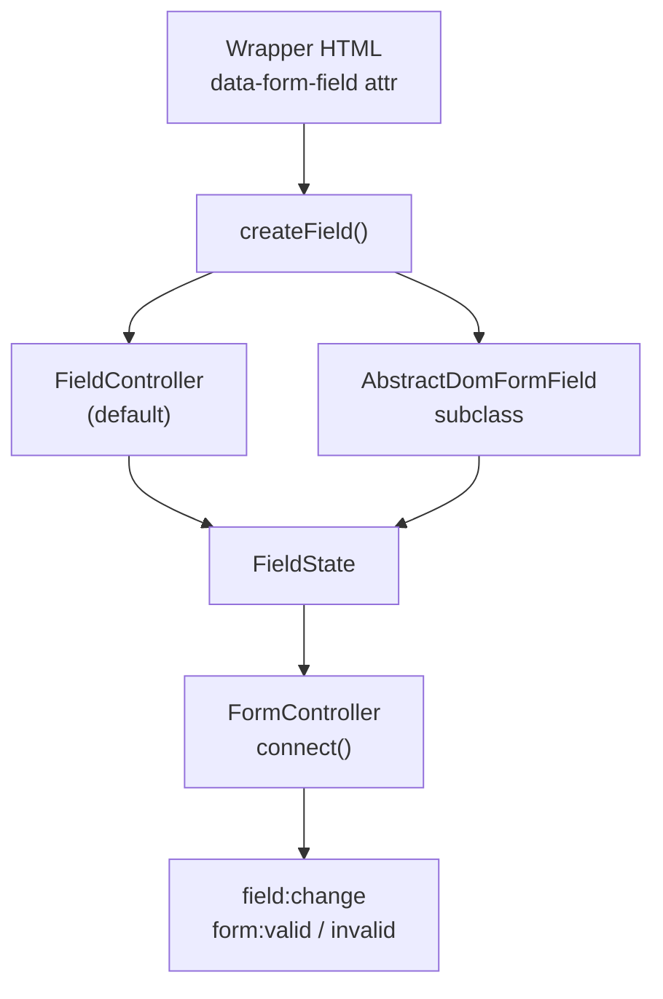
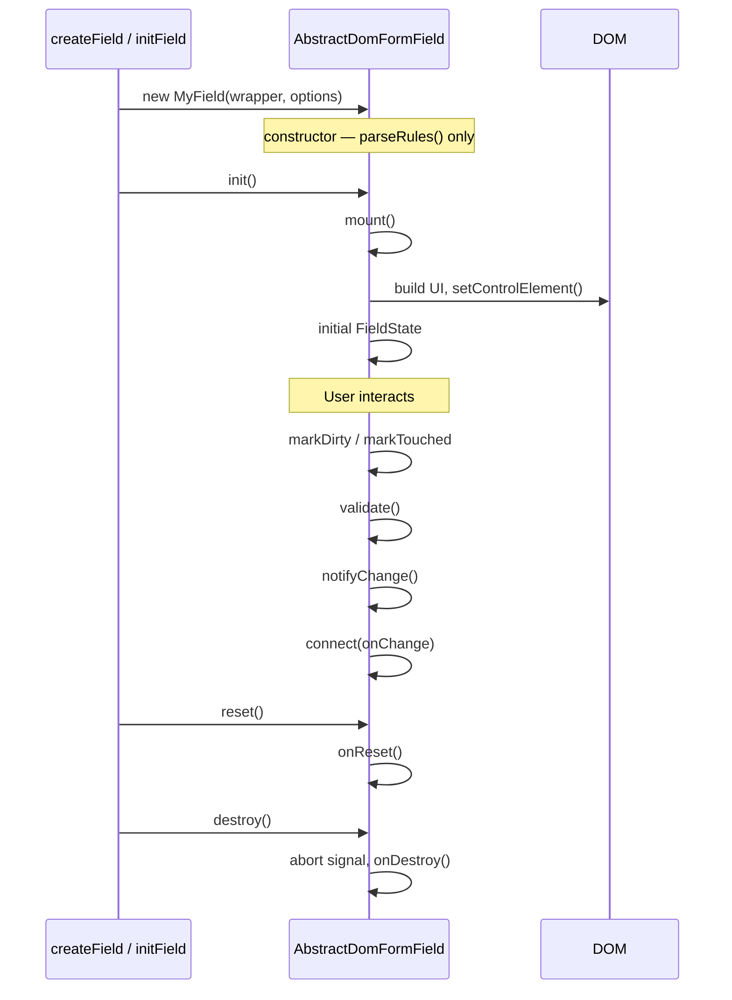

This guide walks through building an **image input with preview** field. By the end you will understand how FormLayer fields work internally: wrapper markup, value flow, validation, lifecycle, and registration.

For the full API surface, see [`AbstractDomFormField`](/reference/abstract-dom-field/).

## How fields fit together

Every field sits inside a `[data-form-field]` wrapper. `FormController` (or `initField()` for standalone use) picks a class from `fieldsMap` based on `data-field-type`, or falls back to [`FieldController`](/reference/field-controller/) for standard inputs.



A field exposes a **canonical string value** through `readValue()`. Validation, server errors, and form state all use that string. Custom UI is your responsibility; the base class handles the rest.

## Field lifecycle



The two-phase creation (construct, then `init()`) is what lets you assign DOM references in `mount()` using ordinary class fields. The factory functions always run both phases — you only ever call `createField`, `initField`, or `initFieldAsync`.

## Step 1 — Markup

Start with progressive-enhancement HTML. The file input must remain in the DOM so the form submits normally without JavaScript.

```html
<div data-form-field="avatar"
     data-field-type="image-input-with-preview"
     data-validate='[{"type":"NotEmpty","options":{"message":"Please choose an image"}}]'>
  <label for="avatar">Profile photo</label>
  <input id="avatar" type="file" name="avatar" accept="image/*" />
  <div id="avatar-errors" class="invalid-feedback"></div>
</div>
```

| Attribute | Role |
|-----------|------|
| `data-form-field` | Field name; must match the control `name` |
| `data-field-type` | Key in `fieldsMap` |
| `data-validate` | JSON array of validator rules |

The errors container follows the usual convention: `#${input.id}-errors` or `.invalid-feedback` inside the wrapper.

## Step 2 — Scaffold the class

Create `fields/image-input-with-preview.ts`:

```typescript
import { AbstractDomFormField } from 'formlayer';
import type { AbstractDomFieldOptions } from 'formlayer';

export default class ImageInputWithPreviewField extends AbstractDomFormField {
  private fileInput!: HTMLInputElement;
  private previewRoot!: HTMLElement;
  private previewImg!: HTMLImageElement;
  private clearButton!: HTMLButtonElement;
  private objectUrl: string | null = null;

  protected mount(): void {
    const input = this.wrapper.querySelector<HTMLInputElement>('input[type="file"]');
    if (!input) {
      throw new Error(
        `[FormsModule] ImageInputWithPreviewField "${this.name}" requires input[type="file"]`,
      );
    }
    this.fileInput = input;

    this.buildPreviewUI();
    this.bindEvents();
    this.setControlElement(this.fileInput);
  }

  protected readValue(): string {
    return this.fileInput.files?.length ? 'selected' : '';
  }

  protected writeValue(_value: string): void {
    // Browsers do not allow setting file input values programmatically.
  }

  protected onReset(): void {
    this.revokePreviewUrl();
    this.fileInput.value = '';
    this.previewImg.removeAttribute('src');
    this.previewRoot.hidden = true;
  }

  protected onDestroy(): void {
    this.revokePreviewUrl();
    this.previewRoot.remove();
    this.fileInput.hidden = false;
  }

  // buildPreviewUI(), bindEvents(), showPreview() — next steps
}
```

### Why `'selected'` as the value?

File inputs expose no stable string for validation. We use a sentinel: empty string when no file is chosen, `'selected'` when one is. [`NotEmpty`](/reference/validators/) treats any non-empty string as valid. The actual file bytes still submit via the native `input` in `FormData`.

For filename-based rules, return `this.fileInput.files?.[0]?.name ?? ''` from `readValue()` instead.

## Step 3 — Build the preview UI

Hide the native input visually (keep it in the DOM for submission) and insert a preview region after it:

```typescript
private buildPreviewUI(): void {
  this.fileInput.classList.add('visually-hidden');

  this.previewRoot = document.createElement('div');
  this.previewRoot.className = 'image-preview-field';
  this.previewRoot.hidden = true;

  this.previewImg = document.createElement('img');
  this.previewImg.className = 'image-preview-field__img';
  this.previewImg.alt = '';

  this.clearButton = document.createElement('button');
  this.clearButton.type = 'button';
  this.clearButton.className = 'image-preview-field__clear';
  this.clearButton.textContent = 'Remove';

  const pickButton = document.createElement('button');
  pickButton.type = 'button';
  pickButton.className = 'image-preview-field__pick';
  pickButton.textContent = 'Choose image…';

  pickButton.addEventListener('click', () => this.fileInput.click(), {
    signal: this.signal,
  });

  this.previewRoot.append(this.previewImg, this.clearButton);
  this.fileInput.insertAdjacentElement('afterend', this.previewRoot);
  this.fileInput.insertAdjacentElement('afterend', pickButton);
}
```

`setControlElement(this.fileInput)` tells FormLayer which element receives `disabled`, error classes (`is-invalid`), and focus when `focus()` is called. The pick button delegates to the file input via `.click()`.

## Step 4 — Wire events

`AbstractDomFormField` does **not** auto-bind input listeners (unlike `FieldController`). You decide when to validate and notify:

```typescript
private bindEvents(): void {
  this.fileInput.addEventListener('change', () => {
    this.markDirty();
    this.markTouched();
    if (this.fileInput.files?.[0]) {
      this.showPreview(this.fileInput.files[0]);
    } else {
      this.onReset();
    }
    this.validate();
    this.notifyChange();
  }, { signal: this.signal });

  this.clearButton.addEventListener('click', () => {
    this.onReset();
    this.markDirty();
    this.markTouched();
    this.validate();
    this.notifyChange();
  }, { signal: this.signal });
}

private showPreview(file: File): void {
  this.revokePreviewUrl();
  this.objectUrl = URL.createObjectURL(file);
  this.previewImg.src = this.objectUrl;
  this.previewImg.alt = file.name;
  this.previewRoot.hidden = false;
}

private revokePreviewUrl(): void {
  if (this.objectUrl) {
    URL.revokeObjectURL(this.objectUrl);
    this.objectUrl = null;
  }
}
```

| Call | When |
|------|------|
| `markDirty()` | User changed something |
| `markTouched()` | User finished interaction (change/blur/commit) |
| `validate()` | Run rules, update error DOM |
| `notifyChange()` | Push new state to the form and emit field events |
| `setValue()` | Programmatic update — combines write, validate, notify |

Use `{ signal: this.signal }` on every listener so `destroy()` cleans up automatically.

## Step 5 — Register the field

```typescript
import { initTypo3Forms } from 'formlayer/typo3';
import ImageInputWithPreviewField from './fields/image-input-with-preview';

initTypo3Forms({
  fieldsMap: {
    'image-input-with-preview': ImageInputWithPreviewField,
  },
});
```

Lazy-load for code splitting:

```typescript
fieldsMap: {
  'image-input-with-preview': () => import('./fields/image-input-with-preview'),
}
```

## Step 6 — Complete implementation

<details>
<summary>Full <code>image-input-with-preview.ts</code></summary>

```typescript
import { AbstractDomFormField } from 'formlayer';

export default class ImageInputWithPreviewField extends AbstractDomFormField {
  private fileInput!: HTMLInputElement;
  private previewRoot!: HTMLElement;
  private previewImg!: HTMLImageElement;
  private clearButton!: HTMLButtonElement;
  private objectUrl: string | null = null;

  protected mount(): void {
    const input = this.wrapper.querySelector<HTMLInputElement>('input[type="file"]');
    if (!input) {
      throw new Error(
        `[FormsModule] ImageInputWithPreviewField "${this.name}" requires input[type="file"]`,
      );
    }
    this.fileInput = input;
    this.buildPreviewUI();
    this.bindEvents();
    this.setControlElement(this.fileInput);
  }

  protected readValue(): string {
    return this.fileInput.files?.length ? 'selected' : '';
  }

  protected writeValue(_value: string): void {}

  protected onReset(): void {
    this.revokePreviewUrl();
    this.fileInput.value = '';
    this.previewImg.removeAttribute('src');
    this.previewRoot.hidden = true;
  }

  protected onDestroy(): void {
    this.revokePreviewUrl();
    this.previewRoot.remove();
    this.fileInput.hidden = false;
    this.fileInput.classList.remove('visually-hidden');
  }

  private buildPreviewUI(): void {
    this.fileInput.classList.add('visually-hidden');

    this.previewRoot = document.createElement('div');
    this.previewRoot.className = 'image-preview-field';
    this.previewRoot.hidden = true;

    this.previewImg = document.createElement('img');
    this.previewImg.className = 'image-preview-field__img';
    this.previewImg.alt = '';

    this.clearButton = document.createElement('button');
    this.clearButton.type = 'button';
    this.clearButton.className = 'image-preview-field__clear';
    this.clearButton.textContent = 'Remove';

    const pickButton = document.createElement('button');
    pickButton.type = 'button';
    pickButton.className = 'image-preview-field__pick';
    pickButton.textContent = 'Choose image…';
    pickButton.addEventListener('click', () => this.fileInput.click(), {
      signal: this.signal,
    });

    this.previewRoot.append(this.previewImg, this.clearButton);
    this.fileInput.insertAdjacentElement('afterend', pickButton);
    this.fileInput.insertAdjacentElement('afterend', this.previewRoot);
  }

  private bindEvents(): void {
    this.fileInput.addEventListener('change', () => {
      this.markDirty();
      this.markTouched();
      if (this.fileInput.files?.[0]) {
        this.showPreview(this.fileInput.files[0]);
      } else {
        this.onReset();
      }
      this.validate();
      this.notifyChange();
    }, { signal: this.signal });

    this.clearButton.addEventListener('click', () => {
      this.onReset();
      this.markDirty();
      this.markTouched();
      this.validate();
      this.notifyChange();
    }, { signal: this.signal });
  }

  private showPreview(file: File): void {
    this.revokePreviewUrl();
    this.objectUrl = URL.createObjectURL(file);
    this.previewImg.src = this.objectUrl;
    this.previewImg.alt = file.name;
    this.previewRoot.hidden = false;
  }

  private revokePreviewUrl(): void {
    if (this.objectUrl) {
      URL.revokeObjectURL(this.objectUrl);
      this.objectUrl = null;
    }
  }
}
```

</details>

## Patterns from built-in plugins

Study the official plugins for more advanced patterns:

| Pattern | Example |
|---------|---------|
| Hidden native control + visible widget | [Combobox](/guides/plugins/#combobox) — `<select>` hidden, text input is `inputElement` |
| Third-party library lifecycle | [Datepicker](/guides/plugins/#datepicker) — init in `mount()`, destroy in `onDestroy()` |
| Commit on blur | Combobox `commitInputValue()` — validate when the user leaves the field |
| `setValue()` for programmatic updates | Combobox `applySelection()` — syncs hidden select and visible label |

```typescript
// Combobox: canonical value lives on the hidden <select>
protected readValue(): string {
  return this.select.value;
}

protected writeValue(value: string): void {
  this.select.value = value;
  const opt = this.comboboxOptions.find((o) => o.value === value);
  this.textInput.value = opt?.label ?? '';
}
```

## Server errors and enable/disable

Server errors work out of the box. After a failed AJAX submit, `FormController` calls `setServerErrors()` on each field. Errors persist until the value changes — try submitting without a file, then pick one; the error should clear.

Client variants ([`formlayer-plugin-client-variants`](/guides/plugins/#client-variants)) call `setEnabled(false)` on fields that fail their condition. The base class hides the wrapper, disables `inputElement`, and skips validation.

## Standalone use

Custom fields work outside a form controller via `initField()`. Pass the class explicitly with the `field` option (standalone fields do not use `data-field-type` or `fieldsMap`):

```typescript
import { initField } from 'formlayer';
import ImageInputWithPreviewField from './fields/image-input-with-preview';

const field = initField(document.querySelector('[data-form-field="avatar"]')!, {
  field: ImageInputWithPreviewField,
});

field.on('change', (state) => {
  console.log(state.value, state.isValid);
});
```

Lazy-load the class with `initFieldAsync()`:

```typescript
import { initFieldAsync } from 'formlayer';

const field = await initFieldAsync(
  document.querySelector('[data-form-field="avatar"]')!,
  () => import('./fields/image-input-with-preview'),
);
```

`initField` / `initFieldAsync` construct the field **and** run its `mount()` setup for you. Do not call `new ImageInputWithPreviewField(wrapper)` directly — a bare instance is not mounted (see [Field lifecycle](#field-lifecycle)).

## Checklist

After implementing a custom field, verify:

- [ ] `mount()` calls `setControlElement()` with the correct focus target
- [ ] `readValue()` matches what validators and the backend expect
- [ ] Listeners use `{ signal: this.signal }`
- [ ] User interactions call `validate()` + `notifyChange()` (or `setValue()`)
- [ ] `onReset()` restores DOM defaults
- [ ] `onDestroy()` removes custom nodes and revokes resources (object URLs, library instances)
- [ ] Form submits the native control value when JavaScript is disabled
- [ ] Error container is found (`#id-errors` or `.invalid-feedback`)

## Next steps

- [Plugins](/guides/plugins/) — register fields globally, lazy loading, built-in plugins
- [`AbstractDomFormField` reference](/reference/abstract-dom-field/) — complete API
- [Error Rendering](/guides/error-rendering/) — customize validation messages
- [Validators](/reference/validators/) — available rule types
