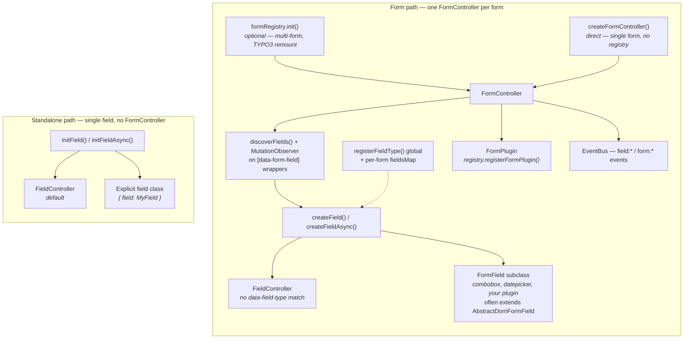

FormLayer is a lightweight TypeScript library for progressively enhancing server-rendered HTML forms. It provides client-side validation, field plugins, an event system, and an optional TYPO3 integration layer — all without requiring React, Vue, or any framework.

## How It Works

FormLayer scans your HTML for forms and fields marked with `data-*` attributes, then wraps each one in a controller that handles:

- **Validation** — declarative rules via `data-validate` JSON, with 12 built-in validators
- **State tracking** — dirty, touched, valid, submitting states per field and form
- **Loading UI** — `data-loading` on submit buttons during submission
- **Error display** — automatic ARIA-compliant error rendering
- **Plugins** — combobox, datepicker, or your own custom field enhancements
- **Events** — form-level and field-level event system for custom behavior
- **Submit handling** — pluggable submit functions with native fallback

Your server renders standard `<form>` HTML. FormLayer enhances it. If JavaScript fails to load, the native form still works.

## Architecture

FormLayer has two entry paths: **form controllers** (full `<form>` enhancement) and **standalone fields** (a single `[data-form-field]` without a form wrapper).



**Form path.** `FormRegistry` discovers forms and attaches globally registered `FormPlugin` instances; you can also call `createFormController()` directly for a single form. Each `FormController` scans for `[data-form-field]` wrappers, resolves the implementation via `createField()` (using `data-field-type` + merged `fieldsMap` / `registerFieldType()`), and wires field state into form-level validation, submit handling, and events.

**Standalone path.** `initField()` enhances one field outside any form. It does not use the registry, does not auto-resolve `data-field-type`, and does not load form plugins — pass `{ field: MyFieldClass }` or use `initFieldAsync()` for code-split custom types. See [Standalone Fields](/guides/standalone-fields/).

Custom field plugins typically extend [`AbstractDomFormField`](/reference/abstract-dom-field/) rather than implementing [`FormField`](/reference/types/#formfield-interface) from scratch. See [Creating Custom Fields](/guides/custom-fields/).

## Key Concepts

### Forms and Fields

A **form** is any `<form>` element with an `id` (required when using `FormRegistry`). A **field** is any element with the `data-form-field` attribute — usually inside a form, but also usable standalone via `initField()`.

Standard fields contain an `input`, `select`, or `textarea`. Custom field types (`data-field-type`) replace the default [`FieldController`](/reference/field-controller/) with a [`FormField`](/reference/types/#formfield-interface) implementation — typically [`AbstractDomFormField`](/reference/abstract-dom-field/) for DOM-backed plugins.

```html
<form id="my-form">
  <div data-form-field="username">
    <label for="username">Username</label>
    <input id="username" type="text" />
  </div>
</form>
```

### The Registry

The `FormRegistry` discovers forms in the DOM, creates a `FormController` per form, and loads registered `FormPlugin` factories — useful for multi-form pages and TYPO3 remounting. For a single form, call `createFormController()` directly without the registry.

Global custom field types are registered with `registerFieldType()` and merged into each form's `fieldsMap`. Per-form overrides pass `fieldsMap` in `FormControllerOptions`.

### Progressive Enhancement

FormLayer strips native HTML5 constraint attributes (`required`, `pattern`, `min`, `max`, etc.) and replaces them with its own validation pipeline. If JavaScript is disabled, browsers still enforce the native attributes. This is progressive enhancement — the baseline always works.

## Packages

FormLayer is split into two layers:

| Layer | Import | Purpose |
|-------|--------|---------|
| **Generic** | `import { formRegistry, initField } from 'formlayer'` | Framework-agnostic form/field controllers, validators, plugins, events, loading state |
| **TYPO3** | `import { initTypo3Forms } from 'formlayer/typo3'` | One-call setup for TYPO3 EXT:form with AJAX submit, multistep remounting, and hooks |

The generic layer has zero TYPO3 knowledge. The TYPO3 layer is a thin wrapper that configures the generic library with TYPO3-specific defaults.
