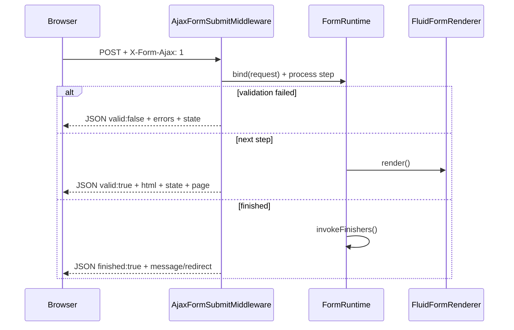

The TYPO3 integration is split into a **frontend JavaScript layer** (`initTypo3Forms`) and a **backend PHP layer** in the sitepackage extension. The backend intercepts AJAX submissions and returns JSON instead of a full HTML page reload.

## Overview



## Request Middleware

`AjaxFormSubmitMiddleware` (`packages/sitepackage/Classes/Middleware/AjaxFormSubmitMiddleware.php`) is registered in `Configuration/RequestMiddlewares.php`:

```php
'frontend' => [
    't13forms/ajax-form-submit' => [
        'target' => \T13Forms\Sitepackage\Middleware\AjaxFormSubmitMiddleware::class,
        'after' => ['typo3/cms-frontend/prepare-tsfe-rendering'],
        'before' => ['typo3/cms-frontend/shortcut-and-mountpoint-redirect'],
    ],
],
```

### Detection

The middleware activates when **all** of the following are true:

- Request method is `POST`
- Header `X-Form-Ajax: 1` is present (set by `createTypo3Submit` on the frontend)

Non-AJAX requests pass through to the normal TYPO3 form controller unchanged.

### Processing Steps

1. **Parse form arguments** from `tx_form_formframework[...]`
2. **Require `__persistenceIdentifier`** — identifies which form definition to load
3. **Load form definition** via `FormPersistenceManager`
4. **Set `renderingOptions.useAjax = true`** — ensures re-rendered HTML includes AJAX-specific hidden fields
5. **Build and bind FormRuntime** — same processing as a normal POST (validation, page resolution, state)
6. **Filter client-variant errors** — errors on conditionally hidden fields are stripped
7. **Return JSON** based on outcome

### JSON Response Shape

Every response uses a consistent structure:

```typescript
{
  valid: boolean;
  errors: Record<string, string[]>;
  page: { current: number; total: number };
  finished: boolean;
  redirect: string | null;
  message: string | null;   // finisher HTML when finished
  html: string | null;      // next step HTML (full <form> from Fluid)
  state: string;            // HMAC-protected serialized FormState
}
```

| Outcome | `valid` | `finished` | `html` | `message` |
|---------|---------|------------|--------|-----------|
| Validation error | `false` | `false` | `null` | `null` |
| Next step (incl. summary) | `true` | `false` | rendered form HTML | `null` |
| Finishers (inline) | `true` | `true` | `null` | finisher output |
| Finishers (redirect) | `true` | `true` | `null` | `null` (+ `redirect`) |

HTTP status codes: `400` for malformed requests, `500` for unhandled exceptions.

### Multistep and Summary Steps

When validation passes and the form is not yet past the last page, the middleware calls `FormRuntime::render()` and returns the result as `html`. This includes:

- Regular input steps
- **Summary steps** (pages with no input fields, only review content)
- Navigation buttons (Next, Previous, Submit)

The rendered HTML is a complete `<form>` element from the Fluid template. The frontend `remount` function replaces the old form's `outerHTML` and registers a fresh controller.

When the user submits the summary step, `__currentPage` indicates past-the-last-page, finishers run, and the response has `finished: true`.

### Required Hidden Fields

The custom Form template outputs these when AJAX is enabled:

```html
<input type="hidden" name="tx_form_formframework[formId-4][__persistenceIdentifier]" value="..." />
<input type="hidden" name="tx_form_formframework[formId-4][__state]" value="..." />
<input type="hidden" name="tx_form_formframework[formId-4][__currentPage]" value="..." />
```

The middleware sets `useAjax: true` on every AJAX request so re-rendered steps always include `__persistenceIdentifier`. Without it, subsequent step submissions fail with a 400 error.

## Fluid Templates

### Plugin Render Template

`Resources/Private/Frontend/Templates/Render.fluid.html` merges the FlexForm AJAX setting into the form configuration before rendering:

```html
<formvh:render overrideConfiguration="{sitepackage:form.mergeAjaxSetting(configuration: formConfiguration, useAjax: settings.useAjax)}" />
```

### Form Template Override

`Resources/Private/Frontend/Templates/Form.fluid.html` extends the default form wrapper:

- Adds `class="t3-form"` and `data-ajax="1"` when AJAX is enabled
- Outputs `__persistenceIdentifier` hidden field when `useAjax` is true
- Renders the current page partial and navigation

Prototype configuration in `Configuration/Form/FrontendOverrides/config.yaml` points template paths to the sitepackage.

## FlexForm Setting

`AddAjaxFlexFormFieldListener` adds a **"Use AJAX submission"** checkbox to the form content element plugin settings in the TYPO3 backend.

When enabled:

1. `MergeAjaxSettingViewHelper` sets `renderingOptions.useAjax = true` on the form definition
2. The Form template outputs AJAX attributes and hidden fields
3. The frontend `initTypo3Forms()` submit handler sends the `X-Form-Ajax` header

Forms without this checkbox use the standard full-page POST flow.

## Client Variants (Server-Side)

`ClientVariantsValidationListener` listens to `AfterCurrentPageIsResolvedEvent` and disables form elements whose `clientVariants` conditions are not met **before** TYPO3 validates the page.

This mirrors the frontend `ClientVariantsPlugin` behavior. The middleware additionally strips validation errors for disabled fields so hidden conditional fields do not block submission.

## ViewHelpers

| ViewHelper | Purpose |
|------------|---------|
| `sitepackage:form.mergeAjaxSetting` | Merges FlexForm `useAjax` into form definition `renderingOptions` |
| `sitepackage:form.validationData` | Outputs `data-validate` JSON for form fields |
| `sitepackage:form.clientVariantsData` | Outputs `clientVariants` JSON for conditional fields |

## Error Handling

Common 400 responses:

| Error | Cause |
|-------|-------|
| `No form data received` | Missing `tx_form_formframework` in POST body |
| `Could not determine form identifier` | Malformed form arguments |
| `Missing persistence identifier` | `__persistenceIdentifier` hidden field missing (often after step transition without `useAjax`) |

On network failure or non-JSON responses, the frontend falls back to native form submission via `fallbackToNative()`.

## File Reference

| File | Role |
|------|------|
| `Classes/Middleware/AjaxFormSubmitMiddleware.php` | AJAX intercept + JSON response |
| `Configuration/RequestMiddlewares.php` | Middleware registration |
| `Classes/EventListener/AddAjaxFlexFormFieldListener.php` | FlexForm AJAX checkbox |
| `Classes/ViewHelpers/Form/MergeAjaxSettingViewHelper.php` | Merge `useAjax` into definition |
| `Classes/EventListener/ClientVariantsValidationListener.php` | Server-side client variant disabling |
| `Resources/Private/Frontend/Templates/Form.fluid.html` | AJAX form wrapper template |
| `Resources/Private/Frontend/Templates/Render.fluid.html` | Plugin render entry point |
