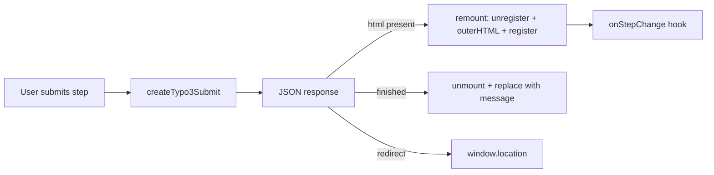

TYPO3 EXT:form supports multistep (multi-page) forms. The FormLayer TYPO3 layer handles step transitions via AJAX without full page reloads.

## How It Works

1. User submits step 1
2. Server validates and returns `{ valid: true, finished: false, html: "...", state: "...", page: { current: 1, total: 3 } }`
3. Frontend **remounts** the form: destroys the old controller, replaces `outerHTML` with the server HTML, registers a fresh controller
4. New fields are discovered; plugins (combobox, datepicker, client-variants) are re-initialized
5. Hidden fields (`__state`, `__persistenceIdentifier`, `__currentPage`) come from the server-rendered HTML
6. User continues to step 2, summary step, and so on
7. On final submission, server returns `{ finished: true }` with either a `redirect` URL or a `message` (HTML)



## Remount vs. Inner HTML Replacement

Step transitions replace the **entire form element** (`outerHTML`), not just inner content. This is necessary because the server renders a complete `<form>` via FluidFormRenderer.

The `remount` function in `initTypo3Forms()`:

1. `formRegistry.unregister(formId)` — destroys controller, plugins, and fields
2. `oldFormEl.outerHTML = html` — replaces DOM
3. `formRegistry.register(newFormEl, submitFn)` — fresh controller on the new element

This ensures clean lifecycle management and avoids nested `<form>` elements.

## Summary Steps

A summary step is a form page with no input fields — only review content and navigation. It works the same as any other step:

- Server renders the summary page via `FormRuntime::render()` and returns it as `html`
- Frontend remounts the form; the new controller has zero `[data-form-field]` elements
- Submit still works: client validation passes (no fields), the request goes to the server
- User clicks Submit on the summary → finishers run → `finished: true`

## Server Response for Each Step

### Validation failure (stay on current step)

```json
{
  "valid": false,
  "errors": {
    "firstName": ["First name is required"],
    "email": ["Please enter a valid email"]
  },
  "page": { "current": 0, "total": 3 },
  "finished": false,
  "redirect": null,
  "message": null,
  "html": null,
  "state": "abc123..."
}
```

The frontend updates the `__state` hidden field so re-submission uses the latest form state.

### Step advance (go to next step or summary)

```json
{
  "valid": true,
  "errors": {},
  "page": { "current": 1, "total": 3 },
  "finished": false,
  "redirect": null,
  "message": null,
  "state": "def456...",
  "html": "<form id=\"multistep-4\" class=\"t3-form\" data-ajax=\"1\">...</form>"
}
```

The `html` field contains a full rendered `<form>` including hidden fields and navigation.

### Final submission (redirect)

```json
{
  "valid": true,
  "errors": {},
  "page": { "current": 2, "total": 3 },
  "finished": true,
  "redirect": "/thank-you",
  "message": null,
  "html": null,
  "state": "ghi789..."
}
```

### Final submission (inline message)

```json
{
  "valid": true,
  "errors": {},
  "page": { "current": 2, "total": 3 },
  "finished": true,
  "redirect": null,
  "message": "<div class=\"success\"><h2>Thank you!</h2></div>",
  "html": null,
  "state": "ghi789..."
}
```

On finish, the frontend calls `unmount()` (registry cleanup) and replaces the form with `message` HTML if present.

## Step Progress Indicator

Use the `onStepChange` hook to build a progress indicator. The hook receives the **new** form element after remount:

```typescript
initTypo3Forms({
  hooks: {
    onStepChange(page, formEl) {
      const indicator = formEl.closest('.form-wrapper')?.querySelector('.step-indicator');
      if (!indicator) return;

      indicator.textContent = `Step ${page.current + 1} of ${page.total}`;

      const progress = formEl.closest('.form-wrapper')?.querySelector('progress');
      if (progress) {
        progress.max = page.total;
        progress.value = page.current + 1;
      }
    },
  },
});
```

:::note
`page.current` is zero-indexed (matches TYPO3's internal page index).
:::

## Scroll to Top on Step Change

```typescript
initTypo3Forms({
  hooks: {
    onStepChange(page, formEl) {
      formEl.scrollIntoView({ behavior: 'smooth', block: 'start' });
    },
  },
});
```

## Loading State During Transitions

FormLayer toggles `data-loading` on the submit button automatically during submission. No manual hooks are required for basic loading UI:

```css
.t3-form button[data-loading] {
  opacity: 0.6;
  pointer-events: none;
}
```

For additional UI (e.g. overlay on the form wrapper), use `form:loading` on the controller returned from `onFormRegistered`:

```typescript
initTypo3Forms({
  hooks: {
    onFormRegistered(api) {
      api.on('form:loading', (detail) => {
        detail.formEl.classList.toggle('is-loading', detail.state.isSubmitting);
      });
    },
  },
});
```

After a remount, re-attach hooks via `onFormRegistered` (fires for each newly registered form).

## Backend Details

See [TYPO3 Backend (PHP)](/guides/typo3-backend/) for middleware behavior, required hidden fields, and the `useAjax` rendering option.
